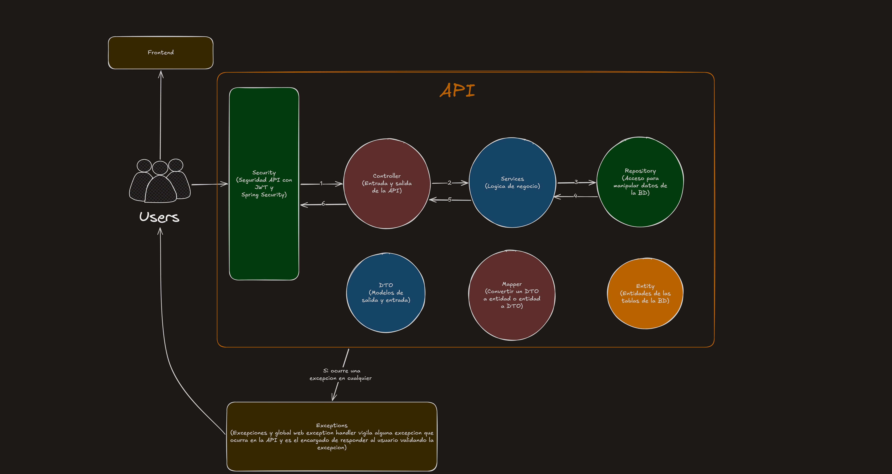
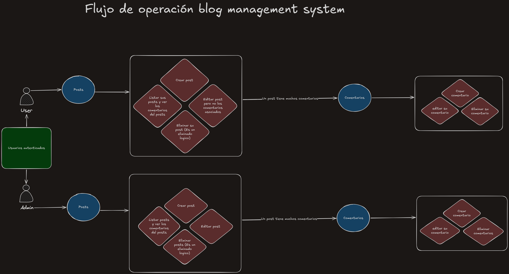
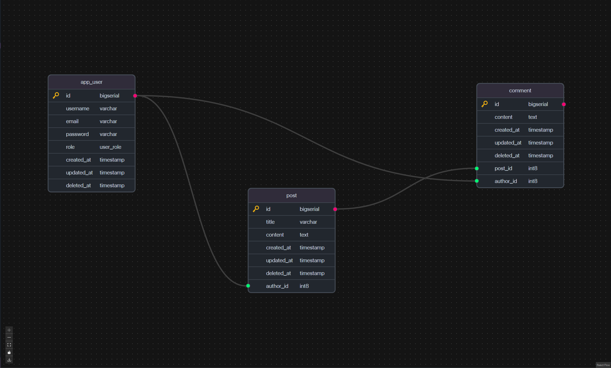

# Blog Management System

> **Autor:** mauricio-bet05  
> **Versión:** 1.0  
> **Última actualización:** 2026-03-09

## 1. Descripción General

El Blog Management System es una aplicación web desarrollada con Java y Maven que permite la gestión completa de un blog. Utiliza una arquitectura por capas con PostgreSQL como base de datos.

## 2. Arquitectura

## 3. Flujo de operación.

## 4. Infraestructura

- **Contenedor PostgreSQL**: Almacenamiento persistente de datos
- **Aplicación Java**: Ejecutada localmente o en contenedor
- **Docker Compose**: Orquestación de servicios

## 5. Estructura de Base de Datos

Las tablas principales incluyen:
- `users` - Usuarios del sistema
- `posts` - Artículos del blog
- `comments` - Comentarios en posts

### Diagrama ER:

Para mas informacion visita el archivo `Init.sql` dentro de la carpeta `db` en el repositorio del proyecto.

## 6. Rutas

Para consultar todas las rutas disponibles, ejemplos de uso y respuestas esperadas, visita el archivo [curls.md](curls.md).

